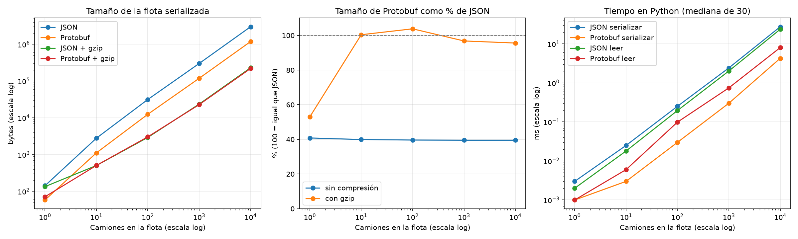

# Experimento: tamaño de los mensajes, Protocol Buffers frente a JSON

Experimento complementario que aporta los datos concretos que pide el ADR D2 (por qué REST hacia afuera y gRPC hacia adentro). Compara el tamaño y el tiempo de serialización de la misma información en Protocol Buffers y en JSON, con y sin compresión gzip.

## Pregunta e hipótesis

**Pregunta.** ¿Cuánto más compacto y rápido es Protocol Buffers que JSON para los datos de la flota, y se mantiene esa diferencia al comprimir con gzip?

**Hipótesis.**
- **H1.** Protobuf es bastante más pequeño que JSON, porque no repite los nombres de los campos (usa números de campo) y codifica los números en binario.
- **H2.** Con gzip la diferencia se achica mucho, porque gzip elimina justamente las repeticiones de nombres de campo que hacen pesado a JSON.
- **H3.** Protobuf es más rápido de serializar y de leer que JSON.

## Método

**Datos.** Una flota de N camiones generada con semilla fija (42), así cada corrida usa exactamente los mismos datos. Cada camión tiene entre 1 y 4 rutas entre 14 ciudades chilenas y capacidades realistas. Se usa el mensaje `Camion` del mismo `flota.proto` del servicio.

**Qué se compara.**
- **Protobuf:** la flota como la envía `ListarFlota` (server streaming): un mensaje por camión más los **5 bytes de encabezado** que agrega gRPC a cada mensaje.
- **JSON:** la misma flota con **los mismos campos y nombres**, con separadores compactos (como responde FastAPI).
- Ambos, además, comprimidos con gzip (nivel por defecto).

**Variable independiente.** Cantidad de camiones: 1, 10, 100, 1000 y 10 000.

**Variables dependientes.** Tamaño en bytes (sin y con gzip), y tiempo de serializar y de leer (mediana de 30 repeticiones, en Python).

## Cómo reproducirlo

No necesita Docker.

```bash
pip install -r experimentos/requirements.txt grpcio-tools
python experimentos/tamano_mensajes/experimento_tamano.py
```

Los tamaños salen idénticos en cada corrida (semilla fija). Los tiempos varían según la máquina.

## Resultados



| Camiones | Protobuf (bytes) | JSON (bytes) | Protobuf / JSON | Protobuf gzip | JSON gzip | Con gzip, Protobuf / JSON | Serializar PB / JSON (ms) | Leer PB / JSON (ms) |
|---|---|---|---|---|---|---|---|---|
| 1 | 58 | 142 | 40.8 % | 71 | 134 | 53.0 % | 0.001 / 0.003 | 0.001 / 0.002 |
| 10 | 1 110 | 2 785 | 39.9 % | 505 | 503 | 100.4 % | 0.003 / 0.025 | 0.006 / 0.018 |
| 100 | 12 438 | 31 418 | 39.6 % | 3 026 | 2 914 | 103.8 % | 0.03 / 0.252 | 0.099 / 0.196 |
| 1000 | 118 604 | 300 080 | 39.5 % | 22 811 | 23 572 | 96.8 % | 0.302 / 2.426 | 0.747 / 2.021 |
| 10000 | 1 183 861 | 2 994 004 | 39.5 % | 219 199 | 229 259 | 95.6 % | 4.278 / 27.524 | 8.056 / 23.724 |

## Análisis

**H1 se cumple: sin compresión, Protobuf pesa el 40 % de JSON** (2,5 veces más pequeño), y la proporción es **constante** de 1 a 10 000 camiones. Es lo esperable: en JSON cada ruta repite `"capacidad_disponible_kg":` y los demás nombres; en Protobuf cada campo es un número de 1 byte.

**H2 se cumple, y con más fuerza de lo esperado: con gzip la ventaja desaparece.** Desde 10 camiones, JSON + gzip y Protobuf + gzip pesan prácticamente lo mismo (entre 96 % y 104 %). Con 10 y 100 camiones, Protobuf + gzip es incluso **un poco más grande** que JSON + gzip. gzip elimina las repeticiones de texto de JSON, y los bytes binarios de Protobuf se comprimen peor.

**Excepción: mensajes pequeños.** Con un solo camión, gzip no sirve: JSON baja apenas de 142 a 134 bytes y Protobuf **sube** de 58 a 71 bytes, porque el encabezado de gzip (~18 bytes) pesa más que lo que ahorra. Ahí Protobuf sin comprimir es la opción más pequeña por lejos (58 contra 134 bytes).

**H3 se cumple.** Serializar con Protobuf es entre **6 y 8 veces más rápido** (4,3 ms contra 27,5 ms con 10 000 camiones) y leer es cerca de **3 veces más rápido** (8,1 ms contra 23,7 ms).

## Conclusiones para el diseño (ADR D2)

1. **Para la comunicación interna Despachos → Flota, gRPC tiene ventaja real.** Son mensajes pequeños y muy frecuentes (`ActualizarCapacidad`, `BuscarDisponibles`), justo donde gzip no ayuda y Protobuf es 2,5 veces más pequeño y varias veces más rápido de procesar. A eso se suma el contrato tipado que el compilador obliga a respetar.
2. **Para la API pública, el tamaño no es un argumento fuerte contra REST.** Con respuestas grandes y gzip, JSON queda del mismo tamaño que Protobuf. Hacia afuera pesa más la interoperabilidad: cualquier cliente (un navegador, curl, un tercero) entiende JSON sin tener el `.proto`, y el navegador no puede hablar gRPC sin un proxy.
3. **"Protobuf es más compacto" es cierto solo con matices**: depende del tamaño del mensaje y de si hay compresión. Afirmarlo sin esos matices sería una conclusión equivocada.

## Limitaciones

- **No incluye los encabezados HTTP.** En una petición real, HTTP/1.1 con JSON repite los encabezados en texto en cada petición, mientras que HTTP/2 (el de gRPC) los comprime con HPACK. Para mensajes pequeños esa diferencia puede pesar más que el cuerpo.
- **Datos sintéticos**: nombres de ciudades cortos y números con un decimal. Con textos más largos, JSON y Protobuf se parecen más (el texto pesa igual en ambos).
- **Tiempos medidos solo en Python** (con las implementaciones en C de protobuf y json). En otros lenguajes la relación puede cambiar. Con 1 y 10 camiones los tiempos están en microsegundos y son poco precisos.
- **gRPC también puede comprimir** sus mensajes; aquí se comparó Protobuf sin compresión, que es la configuración que usa el sistema.
