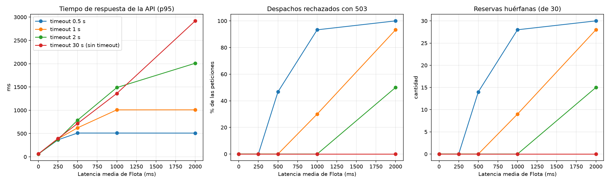

# Experimento: efecto del timeout cuando Flota responde lento

Experimento de la Competencia 6. Mide cómo protege el timeout de la llamada gRPC a la API de Despachos cuando el servicio de Flota se pone lento, y qué se pierde a cambio.

## Pregunta e hipótesis

**Pregunta.** ¿Cómo cambian el tiempo de respuesta y la tasa de rechazo de `POST /v1/despachos` según el timeout que la API le pone a Flota y según qué tan lento responde Flota?

**Hipótesis.**
- **H1.** El timeout pone un techo al tiempo de respuesta de la API: el p95 no supera el valor del timeout, sin importar qué tan lenta esté Flota.
- **H2.** El costo del timeout es rechazar con 503 los despachos cuya respuesta tarda más que el timeout. Mientras más corto el timeout, más rechazos.
- **H3.** Un 503 por timeout no garantiza que la reserva no ocurrió: Flota puede seguir procesando la petición después de que la API dejó de esperar.

## Método

**Variables independientes.**
- Timeout de la API hacia Flota (`GRPC_FLOTA_TIMEOUT`): 0,5 s, 1 s, 2 s y 30 s. El de 30 s representa "prácticamente sin timeout".
- Latencia media de Flota: 0, 250, 500, 1000 y 2000 ms. Se simula con un interceptor gRPC en Flota que agrega un retraso con distribución normal (media indicada, desviación del 30 %), para imitar una red real que no siempre tarda lo mismo. El interceptor solo se activa durante el experimento.

**Variables dependientes.**
- Tiempo de respuesta de la API medido desde el cliente (p50, p95, máximo).
- Porcentaje de respuestas 201 y 503.
- **Reservas huérfanas**: la API respondió 503, pero Flota igual descontó la capacidad. Se calculan comparando la capacidad que bajó en la base de Flota con la que corresponde a los 201.

**Variables controladas.**
- Mismo camión y ruta (`CAM-03`, Concepción → Santiago, 12 000 kg) y misma carga (10 kg), con capacidad de sobra para que ningún despacho falle por falta de capacidad (409).
- La capacidad se reinicia antes de cada combinación.
- Dos peticiones de calentamiento por combinación que no se miden, para que la conexión ya esté abierta.
- Peticiones secuenciales desde un solo cliente, en la misma máquina (Docker local).

**Procedimiento.** 4 timeouts × 5 latencias = 20 combinaciones, **30 repeticiones cada una (600 despachos)**. Después de cada combinación se esperan 2 × latencia + 1 s para que Flota termine las peticiones pendientes antes de leer la capacidad.

## Cómo reproducirlo

```bash
docker compose up -d --build
pip install -r experimentos/requirements.txt
python experimentos/timeout/experimento_timeout.py
```

Tarda unos 8 minutos. Deja los resultados en `resultados/` y al terminar devuelve el sistema a su estado normal (sin latencia y con timeout de 2 s).

## Resultados



| Timeout API (s) | Latencia media Flota (ms) | Éxito 201 (%) | Rechazo 503 (%) | p50 (ms) | p95 (ms) | Máx (ms) | Reservas huérfanas |
|---|---|---|---|---|---|---|---|
| 0.5 | 0 | 100.0 | 0.0 | 56.2 | 60.5 | 61.2 | 0 de 30 |
| 0.5 | 250 | 100.0 | 0.0 | 260.6 | 365.2 | 388.1 | 0 de 30 |
| 0.5 | 500 | 53.3 | 46.7 | 503.2 | 510.8 | 553.0 | 14 de 30 |
| 0.5 | 1000 | 6.7 | 93.3 | 508.4 | 510.5 | 512.2 | 28 de 30 |
| 0.5 | 2000 | 0.0 | 100.0 | 508.1 | 509.6 | 564.2 | 30 de 30 |
| 1 | 0 | 100.0 | 0.0 | 56.5 | 59.9 | 61.4 | 0 de 30 |
| 1 | 250 | 100.0 | 0.0 | 280.7 | 386.2 | 455.2 | 0 de 30 |
| 1 | 500 | 100.0 | 0.0 | 476.9 | 623.2 | 804.9 | 0 de 30 |
| 1 | 1000 | 70.0 | 30.0 | 916.5 | 1008.5 | 1008.7 | 9 de 30 |
| 1 | 2000 | 6.7 | 93.3 | 1008.0 | 1009.2 | 1010.9 | 28 de 30 |
| 2 | 0 | 100.0 | 0.0 | 56.3 | 61.1 | 63.4 | 0 de 30 |
| 2 | 250 | 100.0 | 0.0 | 279.3 | 373.0 | 424.9 | 0 de 30 |
| 2 | 500 | 100.0 | 0.0 | 550.9 | 787.8 | 1164.4 | 0 de 30 |
| 2 | 1000 | 100.0 | 0.0 | 915.1 | 1487.4 | 1751.5 | 0 de 30 |
| 2 | 2000 | 50.0 | 50.0 | 1977.5 | 2009.0 | 2009.8 | 15 de 30 |
| 30 | 0 | 100.0 | 0.0 | 58.8 | 63.3 | 63.8 | 0 de 30 |
| 30 | 250 | 100.0 | 0.0 | 256.1 | 394.2 | 436.8 | 0 de 30 |
| 30 | 500 | 100.0 | 0.0 | 547.2 | 715.7 | 872.7 | 0 de 30 |
| 30 | 1000 | 100.0 | 0.0 | 1034.8 | 1361.1 | 1430.6 | 0 de 30 |
| 30 | 2000 | 100.0 | 0.0 | 1822.2 | 2918.7 | 3159.6 | 0 de 30 |

Los datos de cada petición están en `resultados/resultados_crudos.csv`.

## Análisis

**H1 se cumple: el timeout es un techo.** Con timeout, el p95 nunca supera el timeout en más de ~10 ms (510 ms con 0,5 s, 1009 ms con 1 s, 2009 ms con 2 s), aunque Flota tarde 2 s en promedio. Sin timeout (30 s), el tiempo de la API crece junto con la latencia de Flota: el p95 llega a 2,9 s y el máximo a 3,2 s con 2 s de latencia media. En una caída real (Flota que nunca responde), sin timeout cada petición quedaría esperando hasta 30 s ocupando un hilo de la API.

**H2 se cumple, y el rechazo no es un escalón sino una rampa.** Cuando la latencia media es igual al timeout (0,5 s / 500 ms, 2 s / 2000 ms), se rechaza cerca de la **mitad** de las peticiones: por la variación de la latencia, unas terminan justo antes y otras justo después. Con latencia media del doble del timeout se rechaza más del 90 %. Con latencia media de la mitad del timeout o menos, no se rechazó ninguna.

**H3 se cumple, y es el hallazgo más importante.** En **todas** las combinaciones, la cantidad de reservas huérfanas es **exactamente igual** a la cantidad de 503 (14 de 14, 28 de 28, 9 de 9, 15 de 15…). Es decir: **cada despacho rechazado por timeout igual reservó capacidad en Flota.** La razón es que el timeout es del lado del cliente: la API deja de esperar, pero Flota no se entera y termina de ejecutar la reserva y hace commit. El 503 le dice al usuario "no se pudo" cuando en realidad Flota sí ocupó el espacio. Con 30 despachos rechazados de 10 kg, quedan 300 kg ocupados por despachos que no existen.

## Conclusiones

1. **El timeout protege a la API**: fija un tiempo máximo de respuesta y evita que una Flota lenta deje a la API colgada (falla en cascada). Sin timeout no hay rechazos, pero el tiempo de respuesta queda en manos de Flota.
2. **El valor de 2 s que usa el sistema es razonable para este escenario**: no rechazó ningún despacho con latencias medias de hasta 1 s y acota la espera a ~2 s. Un timeout de 0,5 s ya rechaza la mitad con 500 ms de latencia, que es un retraso plausible en una red con carga.
3. **Pero un timeout por sí solo rompe la consistencia entre servicios.** El experimento mostró que el 100 % de los rechazos por timeout dejó una reserva huérfana en Flota. El 503 es correcto desde el punto de vista del usuario (no sabemos si se reservó), pero el sistema queda con capacidad ocupada que nadie va a liberar.
4. **Mitigaciones posibles** (no implementadas, quedan como trabajo futuro):
   - Que Flota revise si la llamada sigue activa (`context.is_active()`) o si le queda tiempo (`context.time_remaining()`) justo antes del commit, y no reserve si el cliente ya se fue. Reduce el problema, pero no lo elimina (el plazo puede vencer entre el chequeo y el commit).
   - Enviar un id de operación a Flota y hacer `ActualizarCapacidad` idempotente, para que la API pueda reintentar o consultar el resultado sin duplicar la reserva.
   - Un proceso de conciliación que compare los despachos de Despachos con las reservas de Flota y libere las huérfanas.
   - Reservas con expiración: Flota libera la capacidad si no recibe una confirmación en cierto tiempo (patrón *reserve–confirm*, cercano a una Saga de la Unidad 3).

## Limitaciones

- **Un solo cliente y peticiones secuenciales.** No se midió el efecto con muchas peticiones concurrentes, donde sin timeout se agotarían los hilos de la API.
- **Latencia sintética** con distribución normal; una red real puede tener colas más largas (picos ocasionales muy altos).
- **Todo corre en una misma máquina con Docker**, sin red real entre servicios.
- **30 repeticiones por combinación.** Cerca del umbral (latencia ≈ timeout) el porcentaje de rechazo varía entre corridas: en una corrida preliminar interrumpida, la combinación 1 s / 1000 ms dio 50 % de rechazo y en la corrida completa 30 %. La tendencia se mantiene, el valor exacto no.
